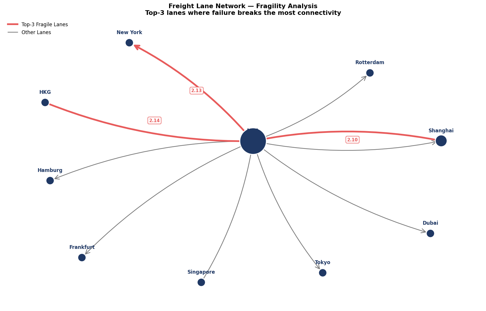
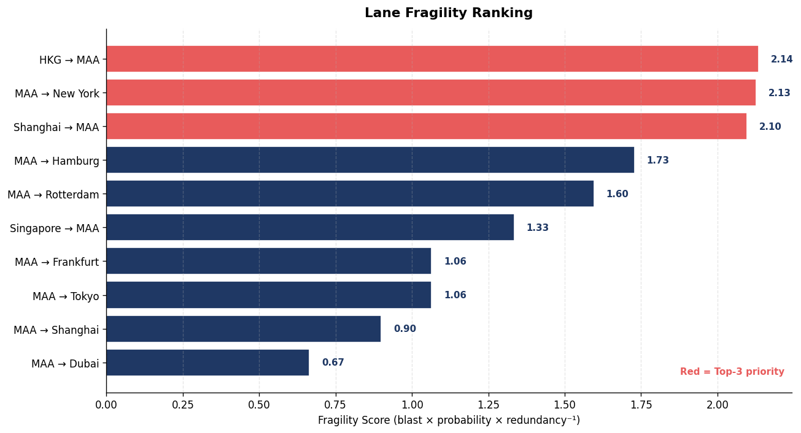

# Freight Lane Network Analysis

> A network-theoretic view of a freight forwarding branch's lane portfolio. Most operators see lanes as a list. This notebook treats them as a directed graph and surfaces structural risks — hub dependencies, route bottlenecks, asymmetric fragility — that are invisible in a tabular view.


---

## The problem

A freight forwarding branch operates dozens to hundreds of lanes. Each lane is a row in a spreadsheet — origin, destination, mode, transit time, carrier, rate. The spreadsheet view encourages questions like *"which lane has the highest revenue?"* and *"what's our average transit time?"*.

It misses the questions that actually matter operationally:

- *If our top inbound lane fails, how much of the network do we lose?*
- *Which lanes are load-bearing vs. interchangeable?*
- *Where are we one disruption away from customer-impact?*
- *Are we a hub, a chain, or something more fragile?*

These are **structural questions** — they're about the *shape* of the network, not the contents of any single row. Tables don't answer them. Graphs do.

## The approach

Model the lane portfolio as a **directed graph**:
- **Nodes** = ports (origins and destinations)
- **Edges** = lanes (directed: MAA → Shanghai is a different service than Shanghai → MAA)
- **Edge attributes** = mode, transit days

Then apply standard graph-theoretic tools to ask structural questions:

1. **Centrality** — which ports are most important, and by which definition of "important"?
2. **Path analysis** — which origin-destination pairs are reachable, and via what route?
3. **Edge-removal simulation** — if a specific lane fails, how much connectivity breaks?
4. **Composite fragility scoring** — combine blast radius, failure probability, and redundancy into a single risk score per lane.

## Headline visual



Top-3 most fragile lanes highlighted in red. The clustering — three high-impact lanes all touching the same hub — reveals a structural pattern that an unranked list of lanes cannot show.

## Key findings

### 1. The network is pure hub-and-spoke

MAA is the only port with non-zero betweenness centrality. Every other port is a terminal — there is no "transit through" any non-MAA port. This is operationally common for a single-branch view but worth confirming explicitly: there are no hidden mid-points in this network.

### 2. Inbound-only ports are the structural weakness

```
HKG → MAA           blast radius: 26.7%
Shanghai → MAA      blast radius: 23.3%
Singapore → MAA     blast radius: 26.7%
```

Each of these lanes is the **only** way the corresponding port reaches the network. Lose the lane → lose the entire downstream reach for that port. By contrast, MAA's outbound lanes (MAA → Frankfurt, MAA → Rotterdam, etc.) each have a uniform ~13% blast radius — meaningful but not catastrophic.

The strategic implication: **resilience investment should focus on inbound redundancy, not outbound lane addition**. Adding a second inbound corridor for HKG (e.g., HKG → Singapore → MAA via a partner carrier) addresses three fragile entry points via transitive paths, far cheaper than adding more outbound lanes.

### 3. Asymmetric damage

Losing `Shanghai → MAA` is over 2× more damaging than losing `MAA → Shanghai`, despite being the same port pair. Inbound edges to a hub carry more network weight than outbound ones, because the inbound is often the only entry while the outbound is one of many exits.

### 4. Density at 11% is healthy for a specialized branch

Of the 90 possible directed edges between 10 ports, only 10 (11%) exist. This isn't a weakness — it's the signature of a focused operation. A 50%+ density would imply the branch tries to operate every possible lane, which is commercially unrealistic. The shape matches a Chennai export-focused branch.

## Full ranking



Three lanes cluster tightly at the top (scores 2.10–2.14) and three intervention recommendations follow:

| Lane | Recommendation |
|---|---|
| **HKG → MAA** | Add second inbound carrier; structural redundancy fix |
| **MAA → New York** | Long transit (32 days) drives probability up — capacity contingency |
| **Shanghai → MAA** | Highest pure blast radius — priority monitoring |

## Tech stack

- **Python 3.10+**
- **pandas** — data manipulation
- **NetworkX** — graph construction, centrality, path algorithms
- **Matplotlib** — visualization

## Repo contents

```
freight-lane-network-analysis/
├── README.md                                  ← you are here
├── notebook/
│   └── freight_lane_network_analysis.ipynb    ← full executable analysis
├── data/
│   └── lanes.csv                              ← lane data (10 lanes, 10 ports)
├── assets/
│   ├── network_overview.png                   ← chart from cell 4
│   ├── fragility_chart.png                    ← chart from cell 10
│   └── fragility_ranking.png                  ← ranked bar chart
└── docs/
    └── METHODOLOGY.md                         ← formulas, assumptions, limitations
```

## How to reproduce

### Option A — Google Colab (no install)

1. Upload `notebook/freight_lane_network_analysis.ipynb` and `data/lanes.csv` to Colab
2. Place `lanes.csv` in a `data/` folder relative to the notebook
3. **Runtime → Run all**

The notebook executes end-to-end in under 30 seconds on a free Colab instance.

### Option B — Local Jupyter

```bash
pip install pandas numpy networkx matplotlib jupyter
jupyter notebook notebook/freight_lane_network_analysis.ipynb
```

## Methodology limitations

This is a portfolio project on synthetic data. Three honest limitations are documented in [`docs/METHODOLOGY.md`](docs/METHODOLOGY.md):

1. **The probability heuristic** uses mode and transit days as proxies. In production, replace with carrier historical on-time data and weather/congestion indicators.
2. **The redundancy count** finds zero alternates for every lane because the graph contains only this branch's lanes. A richer model would include partner-carrier and competitor-network options.
3. **The dataset is small.** The methodology generalizes; demonstrating it convincingly at branch scale (50–200 lanes) is straightforward but not done here.

These aren't flaws to hide — they're the next iteration of the work. Documenting them is the difference between a portfolio piece and a sales pitch.

## Case study context

Built as part of my [supply chain analytics portfolio](https://harshaanandakumar.github.io). The methodology is original; the dataset is fabricated to match the lane structure of a typical Chennai-based forwarding branch. No proprietary data is used.

---

<sub>Built by [Harshaa Nandakumar](https://www.linkedin.com/in/harshaanandakumar/)</sub>
